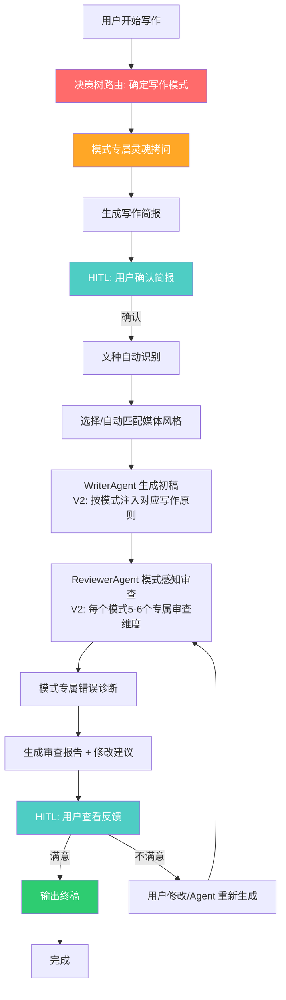

# 公文写作智能体 — 项目设计文档 (V2.2)

***

## 目录

1. [版本说明](#版本说明)
2. [项目背景与目标](#项目背景与目标)
3. [核心设计思路](#核心设计思路)
4. [四大写作模式系统](#四大写作模式系统)
5. [决策树分类结构](#决策树分类结构)
6. [Agentic 设计模式映射](#agentic-设计模式映射)
7. [系统架构图](#系统架构图)
8. [全栈工作流程](#全栈工作流程)
9. [模块功能说明](#模块功能说明)
10. [知识库构成](#知识库构成)
11. [后续规划建议](#后续规划建议)

***

## 版本说明

### V1 → V2：模式感知重构

V1 系统存在一个根本性的信息偏差：将「新闻通讯类研学报道」写作方法论（五大原则）错误地定位为「全类型公文写作系统」的基础，导致了以下问题：

| 偏差维度 | V1 表现 | 影响 |
| ------------- | ------------------ | --------------------- |
| 写作原则 | 五大原则作为全局硬约束 | 行政通知、事故通报等被迫套用战略叙事逻辑 |
| 问卷设计 | 8 道问题自然引导用户走向战略叙事 | 写通知的用户也被要求回答"深层含义是什么" |
| 审查维度 | 五轮审查完全来自写作风格偏好 | 缺少格式合规性、事实准确性等客观审查 |
| System Prompt | 所有文种共享同一套战略基础 | 行文风格被统一为一种调性 |
| 知识库 | 范文/术语/错误模式全部来自单一范式 | 行政文书的格式化规范完全缺失 |

### V2 的解决方案

引入 **WritingMode 系统**，将原「五大原则」从全局硬约束降级为四个可选写作模式之一：

```
Before (V1):
  五大原则 -> 全局硬约束 -> 所有文档类型

After (V2):
  决策树路由 -> 四模式分流 -> 每模式独立的原则/审查/问卷/知识库
```

### V2 → V2.1：迭代式审查修复

**漏洞修复**：ReviewerAgent 的审查从"单次并行"改为"迭代递进"。

```
Before (Bug): 五轮审查对同一份初稿并行执行
  Round 1: 审 original_draft
  Round 2: 审 original_draft  ← 仍然是原始稿！
  Round 3: 审 original_draft

After (V2.1): 真正的 Reflection Pattern
  Round 1: 审 original_draft → 自动修复 → draft_v1
  Round 2: 审 draft_v1       → 自动修复 → draft_v2
  Round 3: 审 draft_v2       → 自动修复 → draft_v3
```

### V2.1 → V2.2：HITL 审查循环 + 风格混合系统

**漏洞 3 修复**：HITL 第二节点从"自动输出"改为"审查 → 修改 → 重新审查"循环。

**漏洞 4 修复**：StyleAdapter 从"单一关键词匹配"升级为混合风格 + 多受众分析 + 强度控制。

| 新增能力 | 说明 |
|----------|------|
| **HITL 审查循环** | 用户可选择自动修复 / 手动选问题修复 / 直接编辑草稿 / 重新审查 |
| **风格混合建议** | 多受众场景自动生成混合风格（如"正文70%人民日报 + 导语30%新华社"） |
| **secondary_audiences 分析** | 同时有领导和媒体时，给出分段落混合风格建议 |
| **风格强度参数** | 0.0-1.0 控制风格特征的注入强度（完整/标准/适度/轻度/极简） |

### 设计依据

V2 的设计综合了以下规范来源：

**第一梯队：党政机关法定规范（强制约束力）**

- 《党政机关公文处理工作条例》(中办发〔2012〕14号) — 15 种法定公文 + 行文规则
- 《党政机关公文格式》(GB/T 9704-2012) — 版头/主体/版记格式规范

**第二梯队：985/211 高校新闻采编规范（核心参照）**

| 高校         | 规范来源            | 核心标准                                               |
| ---------- | --------------- | -------------------------------------------------- |
| **北京大学**   | 新闻网投稿须知         | 消息类 ≤1500 字 / 通讯类 ≤3000 字 / 第三人称叙事 / 叙述准确客观        |
| **北京大学**   | 能源研究院投稿须知       | 第三人称 / 避免"我校""我们" / 图片清晰且含图注                       |
| **北京大学**   | 雏鹰社活动投稿说明       | 新闻稿体例 / 图文结合 / 突出活动亮点                              |
| **南京大学**   | NJUNEWS 新闻网投稿须知 | 消息 800-1000 字 / 通讯 ≤3000 字 / 主题清晰 / 新闻要素齐全         |
| **南京大学**   | 英文官网投稿规范        | 国际化叙事逻辑 / 精简篇幅 / 受众适配                              |
| **北京师范大学** | 科研大讨论新闻采编规范     | 消息为主 / 5W1H 结构 / 300-800 字 / 职务称谓规范 / 格式规范（字体字号行距） |
| **武汉大学**   | 团委来稿须知          | ≥800 字 / 第三人称 / 避免"我院""我专业" / 标题醒目                 |
| **中山大学**   | 英文新闻征稿规范        | 精简篇幅 / 国际化叙事 / 消息类 300-500 英文字                     |
| **华中科技大学** | 征文活动规范          | 1500-3000 字 / 内容真实 / 避免空泛议论                        |

**第三梯队：新闻写作核心规范（通用参照）**

- 5W1H 六要素规范
- 倒金字塔结构（占美国新闻总量 80%）
- 新闻客观性原则（事实与观点分离）

**第四梯队：其他高校与行业规范（辅助参照）**

- 郑州轻工业大学新闻采编规范 — "语言不含糊、不评价""客观陈述事实，少用副词形容词"
- 肇庆学院新闻写作基本规范 — "标题直接点出最有新闻价值的信息"
- 中南财经政法大学团委投稿须知
- 武汉科技大学团委先锋在线投稿规范 — "对内稿件用'我院/我校'，对外稿件用全称"
- 安康日报校园小记者指南 — 校园活动通讯稿入门指导

***

## 项目背景与目标

### 问题痛点

大多数学生/基层公文写作者面临以下问题：

- **目的不明确**：写出来的是"流水账"，没有核心叙事
- **模式错配**：用写通讯的方法写通知，用写报告的思路写简报
- **风格不统一**：不知道对标哪个央媒/规范，导致写作调性混乱
- **缺少审稿机制**：写完无人审查，常见错误反复出现

### 项目定位

一个基于 Agentic Design Patterns 的**多智能体协作公文写作系统**，兼具**教学引导**与**生产辅助**双重功能。

### 核心目标

1. 写作前：通过决策树路由 + 模式专属"灵魂拷问"倒逼思考
2. 写作中：多 Agent 协作，按模式提供风格适配、文种识别、内容生成
3. 写作后：模式感知的多维审查 + 错误诊断 + 修改建议
4. 教学：全程附带写作指导，帮助用户理解"为什么这么写"

***

## 核心设计思路

### 核心心法

公文写作不是记录"发生了什么"，而是回答：

1. 这件事证明了我们是谁？
2. 我们正走向何方？
3. 这件事对组织有什么价值？

### V2 核心创新：四大写作模式并列

不再用一套方法论套所有场景，而是让 AI 先通过决策树判断「这是一篇什么性质的文章」，然后激活对应的写作原则。

***

## 四大写作模式系统

### 模式概览

```
WritingMode:
├── STRATEGIC_NARRATIVE（战略叙事模式）
│   ├── 适用：新闻通讯、研学报道、工作总结、典型人物报道
│   ├── 激活原则：主体性 / 赋能性 / 借势性 / 成长性 / 战略性
│   ├── 对标：人民日报通讯、新华社深度报道、光明日报调研、北大/南大/华科大通讯规范
│   └── 语言：陈述性、写实性，适度使用时代感词汇
│
├── OBJECTIVE_REPORT（客观陈述模式）
│   ├── 适用：事故通报、调研报告、审计报告、整改报告
│   ├── 激活原则：事实准确性 / 逻辑一致性 / 表述客观性 / 问题导向性 / 结论可验证性
│   ├── 对标：新华社消息、国务院事故调查报告、北师大科研新闻采编规范、审计报告标准格式
│   └── 语言：客观中立，数据驱动，不渲染不拔高不借势
│
├── ADMINISTRATIVE（行政行为模式）
│   ├── 适用：通知、请示、批复、函、纪要
│   ├── 激活原则：格式规范性 / 用词准确性 / 合规性 / 简洁性 / 无冗余性
│   ├── 对标：《党政机关公文格式》(GB/T 9704-2012)、国务院公文范例
│   └── 语言：格式化用语，一事一文，三段式结构
│
└── INFORMATIONAL（信息传达模式）
    ├── 适用：简报、消息、活动稿、班级/社团/团日活动
    ├── 激活原则：信息完整性 / 结构清晰性 / 重点突出性 / 不渲染不拔高 / 受众适配性
    ├── 对标：新华社消息规范、北大/南大/武大/北师大/中大等985高校新闻采编规范
    └── 语言：倒金字塔或条目式，让读者30秒内抓住核心信息
```

### 各模式详细原则

#### STRATEGIC\_NARRATIVE（战略叙事原则）

| 原则  | 核心含义        | 自查标准                       |
| --- | ----------- | -------------------------- |
| 主体性 | 镜头始终对准"我们"  | 换成别的单位署名，这段话还能用吗？          |
| 赋能性 | 每段行程回扣培养理念  | 这段行程如果删掉战略锚点句，还能读得通吗？      |
| 借势性 | 以外部权威为组织背书  | 是"借外部之锤，敲自家之钟"，还是仅记录了外部言行？ |
| 成长性 | 用真实感言替代空泛表态 | 如果这段感言去掉后不影响叙事，是否应该删除？     |
| 战略性 | 全文服务于组织长期发展 | 全文读完后，读者是否会产生"应该继续支持"的印象？  |

#### OBJECTIVE\_REPORT（客观陈述原则）

| 原则     | 核心含义           | 自查标准                    |
| ------ | -------------- | ----------------------- |
| 事实准确性  | 所有信息必须核实，标注来源  | 文中每一个数字、名字、日期都有原始出处吗？   |
| 逻辑一致性  | 前后数据不矛盾，因果关系清晰 | 如果读者逐段核对，有没有发现前后矛盾？     |
| 表述客观性  | 不评价、不拔高、不借势    | 删掉所有形容词和副词后，核心信息是否仍然完整？ |
| 问题导向性  | 以问题开篇，不回避矛盾    | 文章是否直面了核心问题？            |
| 结论可验证性 | 所有结论有数据或案例支撑   | 一个完全不了解情况的人能判断结论是否可信吗？  |

#### ADMINISTRATIVE（行政行文原则）

| 原则    | 核心含义                | 自查标准                   |
| ----- | ------------------- | ---------------------- |
| 格式规范性 | 严格遵循 GB/T 9704-2012 | 标题三要素齐全吗？发文字号正确吗？      |
| 用词准确性 | 格式化用语必须准确           | 用公文格式化用语字典逐条核对，有没有用错？  |
| 合规性   | 遵守行文规则              | 行文方向和文种选择正确吗？请示是否一文一事？ |
| 简洁性   | 一事一文，不绕弯子           | 每句话删到只剩主谓宾，核心信息还在吗？    |
| 无冗余性  | 不重复表述               | 有没有哪句话去掉后完全不影响理解？      |

#### INFORMATIONAL（信息传达原则）

| 原则     | 核心含义         | 自查标准                          |
| ------ | ------------ | ----------------------------- |
| 信息完整性  | 5W1H 齐全      | 读者看完第一段，能回答"谁在什么时间什么地点做了什么"吗？ |
| 结构清晰性  | 消息倒金字塔，简报条目式 | 如果只保留前两段，核心信息还在吗？             |
| 重点突出性  | 最重要信息放在最前面   | 标题能让读者3秒内判断这篇文章值不值得读吗？        |
| 不渲染不拔高 | 事实本身足够有力     | 去掉所有评价性词语后，文章还剩下什么？           |
| 受众适配性  | 对内/对外用语不同    | 目标受众会觉得自己被"看见"了吗？             |

***

## 决策树分类结构

### 设计理念

决策树不是简单的文种分类，而是从「用户意图」出发，层层分组，最终映射到写作模式。

### 完整决策树

```
root: 你要写的这篇文章，最核心的目的是什么？
├── [0] 让外界知道、了解、认可我们 → 对外传播
│   └── external_comm: 你希望文章的深度和篇幅是怎样的？
│       ├── [0] 简短精炼（300-800字）→ INFORMATIONAL / news_brief
│       ├── [1] 深度全面（1500-3000字）→ STRATEGIC_NARRATIVE / feature
│       └── [2] 场景驱动（800-1500字）→ INFORMATIONAL / sidelight
│
├── [1] 让内部运转——布置工作、请示审批、传达通知 → 内部行政
│   └── internal_admin: 你具体要写哪种行政文书？
│       ├── [0] 通知 → ADMINISTRATIVE / notice
│       ├── [1] 请示/批复 → ADMINISTRATIVE / request_reply
│       ├── [2] 函 → ADMINISTRATIVE / letter
│       ├── [3] 会议纪要 → INFORMATIONAL / minutes
│       └── [4] 通报 → OBJECTIVE_REPORT / bulletin_formal
│
├── [2] 记录一次活动/事件 → 活动记录
│   └── activity_record: 这次活动的性质和层级是？
│       ├── [0] 班级/团支部活动 → INFORMATIONAL / class_activity
│       ├── [1] 院系/社团活动 → INFORMATIONAL / campus_activity
│       ├── [2] 研学/考察/社会实践 → STRATEGIC_NARRATIVE / study_tour
│       └── [3] 校际/重大活动 → STRATEGIC_NARRATIVE / major_event
│
└── [3] 向上级展示成果、汇报工作 → 汇报总结
    └── report_summary: 你汇报/总结的核心内容是什么？
        ├── [0] 阶段性工作总结 → STRATEGIC_NARRATIVE / work_summary
        ├── [1] 调研/考察报告 → OBJECTIVE_REPORT / research_report
        ├── [2] 事故/问题通报 → OBJECTIVE_REPORT / incident_report
        └── [3] 述职报告 → ADMINISTRATIVE / duty_report
```

### 关键设计点

- **意图优先**：先问"为什么写"，再问"写什么"
- **层层分流**：每个节点 2-5 个选项，避免选择过载
- **不预设模式**：同样是对外传播，可走向 INFORMATIONAL（简短）或 STRATEGIC（深度）
- **同文种可不同模式**：会议纪要走 INFORMATIONAL，但述职报告走 ADMINISTRATIVE

***

## Agentic 设计模式映射

| 设计模式                          | 项目对应实现                                                                                           |
| ----------------------------- | ------------------------------------------------------------------------------------------------ |
| **Planning Pattern**          | Questionnaire 模块：决策树路由 + 模式专属问题集，提前规划写作策略                                                        |
| **Reflection Pattern**        | ReviewerAgent：独立审查 WriterAgent 输出，提供模式感知的反馈与修改建议                                                 |
| **Tool Use Pattern**          | KnowledgeBase：内置范文库、错误模式库、术语库、过渡句库，供 Agent 调用                                                    |
| **Multi-Agent Collaboration** | Orchestrator 协调 Writer / Reviewer / StyleAdapter / DocTypeIdentifier / KnowledgeBase 五个 Agent 协同 |
| **Human-in-the-Loop (HITL)**  | 两个关键节点：1) 确认写作简报后开始 2) 审查终稿前可要求修改                                                                |

***

## 系统架构图

```
┌───────────────────────────────────────────────────────────────────┐
│                        CLI / QuickAPI                              │
│                      (用户交互层 / 程序化调用)                       │
└──────────────────────────────────┬────────────────────────────────┘
                                   │
┌──────────────────────────────────▼────────────────────────────────┐
│                    Orchestrator（协调者 - V2）                      │
│  ┌─────────────────────────────────────────────────────────────┐  │
│  │  新状态机：routing → mode_questioning → planning → writing    │  │
│  │            → reviewing → completed                           │  │
│  │  关键新增：routing 阶段完成决策树路由，确定 WritingMode        │  │
│  │  HITL：写作前确认、终稿前确认                                 │  │
│  │  兼容：保留 skip_questionnaire() 旧版兼容接口                 │  │
│  └─────────────────────────────────────────────────────────────┘  │
└──────────────────────────────────┬────────────────────────────────┘
                                   │
         ┌─────────────────────────┼─────────────────────────┐
         │                         │                         │
         ▼                         ▼                         ▼
┌──────────────────┐    ┌──────────────────┐    ┌──────────────────┐
│  WritingMode     │    │   WriterAgent    │    │  ReviewerAgent   │
│  (模式决策 +     │    │  (内容生成Agent) │    │  (多维审查Agent) │
│   原则激活)      │    │                  │    │                  │
│                  │    │  V2: get_mode()  │    │  V2: set_mode()  │
│  4 种模式        │    │  动态选择原则    │    │  动态选择审查    │
│  4 套原则        │    │  而非硬编码五大  │    │  维度而非五轮    │
│  4 组审查维度    │    │                  │    │                  │
│  4 组问题集      │    │                  │    │                  │
└──────────────────┘    └──────────────────┘    └──────────────────┘
         │                         │                         │
         └─────────────────────────┼─────────────────────────┘
                                   │
         ┌─────────────────────────┼─────────────────────────┐
         │                         │                         │
         ▼                         ▼                         ▼
┌──────────────────┐    ┌──────────────────┐    ┌──────────────────┐
│  StyleAdapter    │    │ DocTypeIdentifier│    │  KnowledgeBase   │
│  (媒体风格适配)  │    │  (文种自动识别)  │    │  (知识库)         │
│                  │    │                  │    │                  │
│  5 种风格        │    │  5 种文种        │    │  范文库 / 错误    │
│  含党政机关      │    │  含通报/简报     │    │  模式库 / 术语    │
│  行文规范风格    │    │                  │    │  库 / 过渡句库    │
└──────────────────┘    └──────────────────┘    └──────────────────┘
```

***

## 全栈工作流程

### 完整流程图 (V2)



### 详细步骤说明

| 阶段               | 模块                               | 核心动作                                                                                      | 输出物                       |
| ---------------- | -------------------------------- | ----------------------------------------------------------------------------------------- | ------------------------- |
| **0. 路由阶段**      | WritingMode                      | 通过决策树 2 层追问，确定写作模式                                                                        | WritingMode 枚举值 + subtype |
| **1. 规划阶段**      | Questionnaire                    | 根据 WritingMode 加载专属问题集（每个模式 6-7 道）                                                        | WritingBrief（写作简报）        |
| **2. HITL 确认 1** | Orchestrator                     | 用户查看、修改、确认写作简报                                                                            | 确认信号                      |
| **3. 风格与文种**     | StyleAdapter / DocTypeIdentifier | 自动识别文种 + 选择媒体风格（含党政机关行文规范风格）                                                              | 风格配置 + 文种配置               |
| **4. 写作阶段**      | WriterAgent + KnowledgeBase      | 基于 Brief + Style + DocType + **WritingMode 专属原则**构建 Prompt                                | 初稿文本                      |
| **5. 多维审查**      | ReviewerAgent                    | **模式感知审查**（非固定五轮）:STRATEGIC: 6 维 / OBJECTIVE: 5 维ADMINISTRATIVE: 5 维 / INFORMATIONAL: 6 维 | 分维度审查报告                   |
| **6. 错误诊断**      | ReviewerAgent                    | **4 个模式专属错误诊断库**，按模式匹配                                                                    | 诊断报告 + 修改建议               |
| **7. HITL 确认 2** | Orchestrator                     | 用户查看反馈，可接受/修改/要求重写                                                                        | 终稿确认信号                    |
| **8. 输出**        | Orchestrator                     | 输出终稿 + 写作简报 + 审查报告 + 模式原则摘要                                                               | 完整交付物                     |

***

## 模块功能说明

### 0. WritingMode（写作模式决策系统）— V2 新增

**文件位置**: `src/core/writing_mode.py`

这是 V2 的核心新增模块，解决了 V1 的根源性偏差。

| 组件                    | 说明                                                                              |
| --------------------- | ------------------------------------------------------------------------------- |
| **WritingMode 枚举**    | 4 个模式：STRATEGIC\_NARRATIVE / OBJECTIVE\_REPORT / ADMINISTRATIVE / INFORMATIONAL |
| **决策树**               | 3 层结构（root → 分支 → 叶子），每个叶子映射到一种模式 + subtype                                     |
| **WritingPrinciples** | 每个模式独立的一套写作原则（3-5 条）+ 内容取舍规则 + 禁用模式 + 语言指南 + 对标来源                               |
| **审查维度**              | 每个模式独立的审查维度（5-6 个），含权重和逐项检查清单                                                   |
| **问卷问题集**             | 每个模式独立的灵魂拷问（6-7 道），含 why\_ask 教学提示和 hint 示例                                     |
| **导航函数**              | `navigate_tree(path)` 根据用户选择路径返回模式；`get_mode_profile(mode)` 获取完整原则              |

### 1. Questionnaire（灵魂拷问模块）— V2 重构

**文件位置**: `src/questionnaire/questionnaire.py`

| V1                     | V2                                       |
| ---------------------- | ---------------------------------------- |
| 固定 8 道问题，所有用户回答同样的内容   | 决策树路由 2 步 + 模式专属问题集 6-7 道                |
| 问题偏向战略叙事（"深层含义""借势机会"） | 行政模式的用户不会被问到"深层含义"                       |
| 单一阶段                   | 三阶段：ROUTING → MODE\_QUESTIONS → COMPLETE |

**新增能力**：

| 功能       | 说明                                        |
| -------- | ----------------------------------------- |
| **路由问题** | `get_routing_question()` 返回决策树当前节点的问题和选项  |
| **逐级路由** | `submit_routing_choice(i)` 支持多级选择，直到到达叶子  |
| **模式问题** | `get_current_mode_question()` 返回当前模式的专属问题 |
| **问题教学** | 每道题附带 `why_ask`（为什么这么问）和 `hint`（示例回答）     |

### 2. StyleAdapter（媒体风格适配模块）— V2.2 增强

**文件位置**: `src/core/style_adapter.py`

| 媒体风格 | 核心特点 | 适合场景 |
|----------|----------|----------|
| **人民日报** | 庄重大气，政策站位高，宏大叙事 | 正式汇报、向上呈文 |
| **新华社** | 严谨凝练，信息密度大，数据与事实驱动 | 新闻通稿、对外发布 |
| **央视新闻** | 场景化叙事，兼具深度与可读性 | 侧记、特写、人物通讯 |
| **光明日报** | 理论性强，注重思想引领 | 调研报告、思想汇报 |
| **党政机关行文规范** | 格式化用语，三段式结构，严格遵循 GB/T 9704-2012 | 通知、请示、批复、函 |

**V2.2 新增能力**：

| 功能 | 说明 |
|------|------|
| **风格混合建议** | `suggest_blend()` 根据多受众生成混合风格建议，如"正文 70% 人民日报 + 导语 30% 新华社" |
| **secondary_audiences 分析** | 支持传入次要受众列表（如 `["领导", "媒体", "学生"]`），自动分析各受众对应的最优风格，给出分段落混合建议 |
| **风格强度参数** | `select_style(style, intensity=0.5)` 控制风格特征的注入强度（0.0-1.0），影响语言特征数量和禁用模式严格度 |
| **强度等级映射** | ≥0.9 完整 / ≥0.7 标准 / ≥0.5 适度 / ≥0.3 轻度 / <0.3 极简 |

### 3. DocTypeIdentifier（文种识别模块）

**文件位置**: `src/core/document_type.py`

| 文种        | 特点          | 篇幅建议        |
| --------- | ----------- | ----------- |
| **消息**    | 5W1H，开门见山   | 500-1000 字  |
| **通讯**    | 场景化，有故事感    | 1000-3000 字 |
| **侧记/特写** | 聚焦特定片段，沉浸式  | 800-1500 字  |
| **调研报告**  | 数据支撑，有分析有结论 | 2000-5000 字 |
| **简报**    | 要点罗列，简洁明了   | 300-800 字   |

### 4. WriterAgent（写作 Agent）— V2 重构

**文件位置**: `src/core/writer_agent.py`

V2 核心变更：不再硬编码五大原则，而是根据 WritingMode 动态注入对应的写作原则。

| 功能         | 说明                                                    |
| ---------- | ----------------------------------------------------- |
| **模式感知**   | `_get_mode()` 从 WritingBrief 或 config 获取当前模式          |
| **原则动态注入** | `_get_principles()` 根据模式从 `get_mode_profile()` 获取专属原则 |
| **内容取舍规则** | System Prompt 中包含模式专属的 `must_write` 和 `must_skip` 清单  |
| **禁用模式列表** | 每个模式有专属的 `forbidden_patterns`，防止套话                    |

### 5. ReviewerAgent（审稿 Agent）— V2 重构 + V2.1 迭代式审查 + V2.2 HITL 循环

**文件位置**: `src/core/reviewer_agent.py`

V2 核心变更：从固定五轮审查改为模式感知的多维审查。

V2.1 核心修复：审查从"单次并行"改为"迭代递进"（审 → 改 → 审 → 改 → 审）。

V2.2 新增：通过 Orchestrator 暴露 HITL 方法（`get_review_issues()` / `apply_manual_fix()` / `re_review()` / `update_draft()`）。

| 模式                       | 审查维度（含权重）                                                                    |
| ------------------------ | ---------------------------------------------------------------------------- |
| **STRATEGIC\_NARRATIVE** | 主体性(20%) + 赋能性(20%) + 借势性(15%) + 成长性(20%) + 战略性(15%) + 事实准确性(10%)            |
| **OBJECTIVE\_REPORT**    | 事实准确性(30%) + 逻辑一致性(25%) + 表述客观性(20%) + 问题导向性(15%) + 格式规范性(10%)               |
| **ADMINISTRATIVE**       | 格式规范性(30%) + 用词准确性(25%) + 合规性(20%) + 简洁性(15%) + 事实准确性(10%)                   |
| **INFORMATIONAL**        | 信息完整性(25%) + 结构清晰性(20%) + 重点突出性(20%) + 不渲染不拔高(15%) + 受众适配性(10%) + 事实准确性(10%) |

**新增能力**：

| 功能               | 说明                                          |
| ---------------- | ------------------------------------------- |
| **4 个模式专属错误诊断库** | 替代原来 7 种通用错误模式，每个模式有独立的错误识别规则               |
| **格式合规性检查**      | ADMINISTRATIVE 模式增加标题三要素、发文字号、结尾用语等检查       |
| **客观性检查**        | OBJECTIVE\_REPORT 模式增加绝对化表述、借势攀附、形容词替代事实等检查 |
| **主体性比率检查**      | STRATEGIC\_NARRATIVE 模式保留"我们"占比统计           |

### 6. Orchestrator（协调者 Agent）— V2 重构 + V2.2 HITL 循环

**文件位置**: `src/core/orchestrator.py`

| 新增能力 | 说明 |
|----------|------|
| **路由工作流** | `start_routing()` → `submit_routing_choice()` → 确定模式 |
| **模式问题工作流** | 路由完成后自动加载模式专属问卷 |
| **新版完整流程** | routing → mode_questioning → planning → writing → reviewing → completed |
| **旧版兼容** | `skip_questionnaire()` 保留，支持直接指定模式跳过路由 |
| **V2.2 HITL 审查循环** | `get_review_issues()` 获取问题列表 / `apply_manual_fix()` 手动修复单个问题 / `re_review()` 重新审查 / `update_draft()` 手动替换草稿 |

### 7. KnowledgeBase（知识库）

**文件位置**: `src/knowledge/knowledge_base.py`

详见下一章节。

***

## 知识库构成

### 1. 范文库（4 篇）

| 范文编号 | 媒体来源 | 文种类型 | 特点          |
| ---- | ---- | ---- | ----------- |
| 范文 1 | 人民日报 | 通讯   | 战略高度 + 宏大叙事 |
| 范文 2 | 新华社  | 消息   | 数据密集 + 事实驱动 |
| 范文 3 | 央视新闻 | 侧记   | 场景化 + 情感深度  |
| 范文 4 | 光明日报 | 调研报告 | 理论深度 + 思想引领 |

### 2. 错误模式库 — V2 升级为 4 个模式专属库

V1 的 7 种通用错误模式已升级为 4 个模式专属诊断库：

| 错误库                      | 错误类型示例                                       |
| ------------------------ | -------------------------------------------- |
| **STRATEGIC\_NARRATIVE** | 流水账 / 主体缺失 / 空泛表态 / 无战略锚点 / 无借势 / 无成长 / 结尾平淡 |
| **OBJECTIVE\_REPORT**    | 数据无来源 / 逻辑跳跃 / 绝对化表述 / 回避核心问题 / 借势攀附         |
| **ADMINISTRATIVE**       | 格式不全 / 文种错误 / 口语化表述 / 多头请示 / 漏签签发人           |
| **INFORMATIONAL**        | 5W1H 缺失 / 结构混乱 / 标题无信息量 / 评价堆砌 / 称谓不当        |

### 3. 术语库（5 条 + 扩展中）

涵盖：主体性 / 赋能性 / 借势性 / 成长性 / 战略性 / 新质生产力 / 公文格式化用语

### 4. 过渡句库（20+ 条）

涵盖：段落间过渡 / 场景切换 / 观点递进 / 从事实到升华

***

## 后续规划建议

### 阶段 1：核心功能落地（当前）

已完成：

- V2 架构全面重构，10 模块测试全部通过
- 四模式写作系统：决策树 + 专属原则 + 专属审查 + 专属问卷
- 决策树路由 + 模式感知的多 Agent 协作

### 阶段 2：LLM 接入

- 接入 OpenAI / Claude / 通义千问 / 文心一言
- 实现真正的内容生成与模式感知审查
- 优化 Prompt 工程

### 阶段 3：增强功能

- **模板管理**：用户可自定义常用模板
- **历史记录**：保存写作历史，便于复用
- **协作模式**：多人协同写作 + 审阅
- **导出功能**：Word / Markdown / PDF 导出

### 阶段 4：Web 界面

- 开发基于 Streamlit / Gradio / Vue 的 Web 应用
- 拖拽式素材管理
- 可视化审稿（高亮问题区域）
- 实时协作

### 阶段 5：部署与运营

- Docker 容器化部署
- 用户权限管理
- 使用数据分析
- 持续优化 Prompt 与错误模式库

***

## 技术栈

| 层级       | 技术选型                    | 说明                             |
| -------- | ----------------------- | ------------------------------ |
| **开发语言** | Python 3.10+            | 类型注解 + 现代语法                    |
| **数据结构** | dataclasses + Enum      | 类型安全 + 可读性                     |
| **核心模式** | Agentic Design Patterns | 多 Agent 协作 + Reflection + HITL |
| **架构创新** | WritingMode 决策树         | 意图路由 + 模式分流 + 动态原则激活           |
| **知识管理** | 内置知识库（Python 数据结构）      | 零依赖，本地完全可用                     |
| **测试框架** | 原生 Python               | 10 个测试用例全部通过                   |
| **接口层**  | CLI + QuickAPI          | 交互式 + 程序化调用双支持                 |

***

## 文件结构

```
official_writer_agent/
├── __init__.py
├── cli.py                          # 交互式 CLI 入口
├── PROJECT_DESIGN.md               # 本文档（V2）
├── README.md                       # 快速开始指南
├── src/
│   ├── __init__.py
│   ├── core/
│   │   ├── __init__.py
│   │   ├── writing_mode.py         # 写作模式系统（V2 新增）
│   │   ├── orchestrator.py         # 协调者 Agent（V2 重构）
│   │   ├── writer_agent.py         # 写作 Agent（V2 重构）
│   │   ├── reviewer_agent.py       # 审稿 Agent（V2 重构）
│   │   ├── style_adapter.py        # 风格适配模块
│   │   └── document_type.py        # 文种识别模块
│   ├── questionnaire/
│   │   ├── __init__.py
│   │   └── questionnaire.py        # 灵魂拷问模块（V2 重构）
│   ├── knowledge/
│   │   ├── __init__.py
│   │   └── knowledge_base.py       # 知识库
│   ├── templates/
│   │   └── __init__.py
│   └── utils/
│       ├── __init__.py
│       └── text_sanitizer.py       # 文本清洗工具
└── tests/
    ├── __init__.py
    └── test_all.py                 # 全模块测试（V2：含模式感知测试）
```

***

## 总结

V2 的核心创新：

1. **从"一套方法论套所有场景"到"模式感知"**：通过决策树路由，为行政通知/事故通报/新闻通讯/校园活动分别激活不同的写作原则、审查维度和问卷问题集
2. **从"固定五轮审查"到"模式专属多维审查"**：STRATEGIC 侧重主体性/借势性，ADMINISTRATIVE 侧重格式/合规性，OBJECTIVE 侧重事实准确性/客观性
3. **从"一刀切问卷"到"先路由再问答"**：用户不再被问到与自身需求不相关的问题
4. **教学-生产一体化**：每个模式的每道问卷问题都附带 why\_ask 和 hint，全程教学
5. **多 Agent 协作 + Reflection + HITL**：Writer 写，Reviewer 审，KnowledgeBase 提供弹药，HITL 双节点控制

目前已完成**V2 完整框架实现**，10 个测试全部通过，接入 LLM 后即可投入实际使用。
