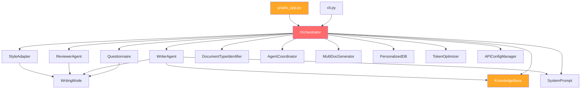

# 公文写作智能体 — 全方位架构审查报告

> **审查日期**: 2026-08-09  
> **审查范围**: 架构设计 · 可维护性 · 产品就绪度  
> **代码规模**: 34 Python 文件 · 20,684 行 · 930KB（不含插件目录）

---

## 一、项目全景

### 1.1 核心指标

| 维度 | 数据 |
|------|------|
| Python 文件 | 34 个 |
| 总行数 | 20,684 行 |
| 总大小 | 930KB |
| src/core/ | 11 文件 · 460KB（占总量 49%） |
| Gradio UI | 2 文件 · 331KB（占总量 36%） |
| 单文件最大 | gradio_app_v1.py — 4,047 行 · 200KB |
| 第二大文件 | gradio_app.py — 2,762 行 · 132KB |
| 核心最大文件 | orchestrator.py — 1,833 行 · 88KB |

### 1.2 文件规模分布（按行数）

```
orchestrator.py     ████████████████████████████████████  1833 lines
knowledge_base.py   ███████████████████████████████████   1803 lines
reviewer_agent.py   ██████████████████████               1171 lines
agent_coordinator.py████████████████████████             1248 lines
document_type.py    ████████████████████                 1049 lines
personalized_db.py  ███████████████████                   996 lines
style_adapter.py    █████████████████                      849 lines
writing_mode.py     █████████████                          696 lines
questionnaire.py    ██████████                             539 lines
token_optimizer.py  ██████████                             522 lines
multi_doc_generator ████████                               410 lines
writer_agent.py     ███████                                399 lines
url_importer.py     ███████                                388 lines
tool_definitions.py ███████                                378 lines
text_sanitizer.py   ██████                                 325 lines
system_prompt.py    ██████                                 311 lines
api_config.py       █████                                  283 lines
cli.py              ██████                                 317 lines
```

> [!CAUTION]
> **8 个文件超过 500 行。** Orchestrator 和 KnowledgeBase 接近 2000 行。这已远超一个 agent 能在单次上下文中完全理解和可靠编辑的范围。

---

## 二、架构审查

### 2.1 模块依赖图



### 2.2 核心问题：God Object Orchestrator

[orchestrator.py](file:///c:/Users/王为韬/OneDrive/桌面/项目/python/official_writer_agent/src/core/orchestrator.py) 是整个系统的最大风险点。

**症状**：
- 1,833 行 · 88KB · **48 个方法**
- 同时负责：状态机管理、LLM 调用、工具执行、审查协调、多版本生成、UI 格式化输出、Token 优化、API 管理
- 直接依赖 **12 个其他模块**（Questionnaire, WriterAgent, ReviewerAgent, AgentCoordinator, MultiDocGenerator, StyleAdapter, DocumentTypeIdentifier, KnowledgeBase, TokenOptimizer, SystemPrompt, APIConfigManager, PersonalizedDB）

**48 个方法按职责聚类**：

| 职责域 | 方法数 | 示例 |
|--------|--------|------|
| 状态机 & 路由 | 8 | `start_routing`, `submit_routing_choice`, `submit_mode_answer` |
| 写作流程 | 6 | `generate_plan`, `write`, `_build_structure_outline` |
| 审查流程 | 9 | `review`, `re_review`, `_run_llm_iterative_review`, `_check_and_run_debate` |
| LLM 调用 | 5 | `_call_llm`, `_do_llm_request`, `_call_llm_with_tool_loop`, `_generate_fallback` |
| 工具执行 | 2 | `_execute_tool_call`, `get_tool_execution_log` |
| UI 格式化 | 4 | `get_workflow_summary`, `get_agent_log_display`, `_build_review_summary_display` |
| HITL | 4 | `get_review_issues`, `apply_manual_fix`, `update_draft`, `finalize` |
| 配置注入 | 6 | `set_user_memory`, `set_personalized_db`, `_get_pdb`, `_get_knowledge_base` |
| Token 优化 | 2 | `_compute_style_blend`, `_detect_style_conflict` |
| 统计 | 2 | `get_api_stats`, `get_llm_prompts` |

> [!IMPORTANT]
> **重构建议**：拆分为至少 4 个独立类：
> 1. **StateMachine** — 纯状态转换逻辑
> 2. **LLMClient** — 所有 LLM 调用、重试、缓存、Token 优化
> 3. **ReviewPipeline** — 审查迭代、HITL、辩论协商
> 4. **Orchestrator** — 瘦协调器，组合以上三者

### 2.3 知识库的数据与代码耦合

[knowledge_base.py](file:///c:/Users/王为韬/OneDrive/桌面/项目/python/official_writer_agent/src/knowledge/knowledge_base.py) — 1,803 行 · 84KB

**问题**：大量结构化数据（范文、术语、错误模式、过渡句）直接硬编码在 Python 源码中，而非存储在 JSON/YAML 外部文件中。

**影响**：
- 非开发者无法编辑和维护知识库
- 每次知识库更新都需要修改代码
- 文件过大，难以做 code review

### 2.4 Gradio UI 的双文件问题

| 文件 | 行数 | 大小 | 状态 |
|------|------|------|------|
| [gradio_app_v1.py](file:///c:/Users/王为韬/OneDrive/桌面/项目/python/official_writer_agent/gradio_app_v1.py) | 4,047 | 200KB | 疑似废弃版本 |
| [gradio_app.py](file:///c:/Users/王为韬/OneDrive/桌面/项目/python/official_writer_agent/gradio_app.py) | 2,762 | 132KB | 当前版本 |

**问题**：
- 两个文件共 331KB，即使 `gradio_app_v1.py` 是废弃的也仍然占据仓库
- 当前版本 `gradio_app.py` 仍然是一个 2,762 行的巨型文件
- UI 逻辑、事件处理、CSS 样式全部耦合在同一文件中

### 2.5 System Prompt 碎片化

> [!WARNING]
> `system_prompt.py` 定义了完整的 `_CORE_SYSTEM_PROMPT`，但 `writer_agent.py` 实现了自己的碎片化版本。实际运行时，`system_prompt.py` 的核心 prompt 可能从未被完整使用。

- [system_prompt.py](file:///c:/Users/王为韬/OneDrive/桌面/项目/python/official_writer_agent/src/config/system_prompt.py) — 定义了 `_CORE_SYSTEM_PROMPT` + `EnvState`
- [writer_agent.py](file:///c:/Users/王为韬/OneDrive/桌面/项目/python/official_writer_agent/src/core/writer_agent.py) — 自行拼装 prompt，部分重复 system_prompt.py 的内容
- [tool_definitions.py](file:///c:/Users/王为韬/OneDrive/桌面/项目/python/official_writer_agent/src/config/tool_definitions.py) — 定义了工具但可能从未被真正暴露给 LLM

### 2.6 未在设计文档中记录的模块

PROJECT_DESIGN.md（V2.2）描述了 7 个模块，但实际代码中有 **11 个核心模块**：

| 模块 | 记录状态 | 说明 |
|------|----------|------|
| writing_mode.py | ✅ 已记录 | 已升级到5模式（文档仍写4模式） |
| orchestrator.py | ✅ 已记录 | — |
| writer_agent.py | ✅ 已记录 | — |
| reviewer_agent.py | ✅ 已记录 | — |
| style_adapter.py | ✅ 已记录 | — |
| document_type.py | ✅ 已记录 | — |
| knowledge_base.py | ✅ 已记录 | — |
| **agent_coordinator.py** | ❌ **未记录** | 1,248行 · 多 Agent 消息总线 + 辩论共识 |
| **multi_doc_generator.py** | ❌ **未记录** | 410行 · 多文种衍生生成 |
| **personalized_db.py** | ❌ **未记录** | 996行 · 用户画像 + 项目管理 + 持久化 |
| **system_prompt.py** | ❌ **未记录** | 311行 · 核心系统提示词 |
| **tool_definitions.py** | ❌ **未记录** | 378行 · 工具定义注册表 |
| **token_optimizer.py** | ❌ **未记录** | 522行 · 六大Token优化策略 |
| **url_importer.py** | ❌ **未记录** | 388行 · URL文档导入 |
| **api_config.py** | ❌ **未记录** | 283行 · API配置管理 |

> [!WARNING]
> 文档与代码严重脱节。设计文档还停留在 V2.2（4模式），但代码已经是 5 模式（含 YOUTH_ENGAGEMENT）。未记录的 4,000+ 行代码占核心模块的 40%。

---

## 三、可维护性审查

### 3.1 代码质量信号

#### 正面信号
- ✅ 使用了 `dataclass` 和 `Enum` 进行类型建模
- ✅ 写作原则、审查维度、错误模式等知识体系设计精良
- ✅ 决策树路由逻辑清晰（writing_mode.py 的 DECISION_TREE 结构）
- ✅ 模式感知的审查维度权重设计合理
- ✅ Token 优化策略考虑周全（六大策略）
- ✅ 有 response_cache 机制避免重复 LLM 调用

#### 负面信号
- ❌ 多个 2000 行级文件，远超合理的模块规模
- ❌ Orchestrator 是 God Object，承担了过多职责
- ❌ 知识库数据硬编码在 Python 源码中
- ❌ System Prompt 定义碎片化，实际使用路径不清晰
- ❌ 文档与代码版本不同步
- ❌ 存疑的废弃文件（gradio_app_v1.py, _fix_iter.py, check_gradio.py, test_gradio_input.py）

### 3.2 根目录杂物清单

| 文件 | 大小 | 性质 |
|------|------|------|

| [_fix_iter.py](file:///c:/Users/王为韬/OneDrive/桌面/项目/python/official_writer_agent/_fix_iter.py) | 4.5KB | 一次性修复脚本 |
| [check_gradio.py](file:///c:/Users/王为韬/OneDrive/桌面/项目/python/official_writer_agent/check_gradio.py) | 1.8KB | 调试工具 |
| [test_gradio_input.py](file:///c:/Users/王为韬/OneDrive/桌面/项目/python/official_writer_agent/test_gradio_input.py) | 476B | 调试用例 |
| [test_minimal.py](file:///c:/Users/王为韬/OneDrive/桌面/项目/python/official_writer_agent/test_minimal.py) | 1KB | 最小测试 |
| [run_tests.py](file:///c:/Users/王为韬/OneDrive/桌面/项目/python/official_writer_agent/run_tests.py) | 143B | 测试启动器 |


### 3.3 插件/Skill 目录（建议忽略）

以下目录是外部引用的 skill 框架，与核心产品无关，建议从审查范围排除或移入 `.gitignore`：

- `.hallmark-skill/` — 外部 skill 框架仓库
- `.impeccable/` — 代码审查 skill
- `andrej-karpathy-skills/` — Karpathy guidelines skill
- `superpowers/` — Superpowers skill 集
- `impeccable/` — Impeccable skill 集
- `graphify/` — Graphify 知识图谱工具

---

## 四、产品就绪度评估

### 4.1 从当前状态到 "可部署产品" 的差距

```
当前状态                                         目标状态
┌──────────────┐                              ┌──────────────┐
│ ✅ 决策树路由  │                              │ ✅ 决策树路由  │
│ ✅ 5模式原则   │                              │ ✅ 5模式原则   │
│ ✅ 问卷系统    │                              │ ✅ 问卷系统    │
│ ✅ 风格适配    │                              │ ✅ 风格适配    │
│ ✅ 文种识别    │                              │ ✅ 文种识别    │
│ ⚠️ 写作Agent  │  ← 占位符/碎片化prompt         │ ✅ 真正的LLM写作│
│ ⚠️ 审查Agent  │  ← 规则审+LLM审部分空转        │ ✅ 迭代式LLM审查│
│ ⚠️ 工具系统   │  ← 定义了但未暴露给LLM          │ ✅ 原生函数调用  │
│ ❌ 统一Prompt  │  ← 碎片化，system_prompt被绕过  │ ✅ 单一Prompt源 │
│ ⚠️ Gradio UI  │  ← 功能基本完整但巨型文件        │ ✅ 模块化UI    │
│ ❌ 测试覆盖    │  ← tests/test_all.py 可能过时   │ ✅ 完整测试套件 │
│ ❌ 文档同步    │  ← 设计文档落后于代码            │ ✅ 文档=代码   │
└──────────────┘                              └──────────────┘
```

### 4.2 关键差距详解

#### P0：LLM 集成路径不清晰

- `_call_llm()` 方法存在并且可以调用真实 API（通过 `api_config.py`）
- 但 `writer_agent.py` 的 prompt 构建与 `system_prompt.py` 脱节
- `tool_definitions.py` 定义了 10+ 个工具（`diagnose_text`, `search_exemplars` 等），但使用的是自定义的 `[TOOL_CALL: ...]` 语法而非原生 function calling
- 这意味着接入任何 LLM 都需要：(1) 统一 prompt 源 (2) 决定是用自定义工具语法还是迁移到原生 function calling

#### P1：审查循环已修复但可能仍有问题

- V2.1 将审查从"并行"改为"迭代递进"（审 → 改 → 审）
- 但 `_run_llm_iterative_review()` 的实现依赖 LLM 输出的结构化解析（`_parse_llm_review()`），鲁棒性未经大规模验证
- Agent 间的辩论协商（`_check_and_run_debate` + `AgentCoordinator`）逻辑完整但 UI 层完全不可见

#### P2：UI 功能与后端数据的断层

根据既有 REVIEW_REPORT.md 的发现：
- `url_importer` 提取了丰富的元数据，但 UI 只用了 2 个字段
- `personalized_db` 定义了完整的用户画像，但很多字段在 UI 中不可编辑
- 多 Agent 协商过程在 UI 中完全不可见

### 4.3 就绪度评分

| 维度 | 评分 | 说明 |
|------|------|------|
| 知识体系设计 | 9/10 | 五模式 + 决策树 + 审查维度 — 设计精良 |
| 架构清晰度 | 5/10 | God Object + 碎片化 prompt + 大文件 |
| LLM 集成 | 4/10 | 基础设施在，但 prompt 路径混乱，工具系统未打通 |
| UI 完整度 | 6/10 | 基本功能齐全，但与后端数据断层严重 |
| 测试覆盖 | 3/10 | 只有一个 test_all.py，未知是否仍通过 |
| 文档一致性 | 3/10 | 设计文档落后代码至少一个大版本 |
| 部署就绪 | 2/10 | 无 Docker、无 requirements.txt、无 CI/CD |
| **综合** | **4.5/10** | 优秀的领域设计 + 需要重构的工程实现 |

---

## 五、重构路线图（建议）

### 阶段 0：清理与对齐（1-2 天）✅ 已完成

- [x] 删除或归档 `_fix_iter.py`、`check_gradio.py`、`test_gradio_input.py`、`test_minimal.py`
- [x] 更新设计文档至 V3.0，补全所有未记录模块
      > 注：`PROJECT_DESIGN.md` 已被 `docs/SYSTEM_DESIGN.md`（V3.0）取代；已补全第 5 模式 `YOUTH_ENGAGEMENT`（青年共情）、知识库数据资产表（V3.1 数据分离）
- [x] 将 `knowledge_base.py` 的数据部分提取到 `src/knowledge/data/*.json` 外部文件
      > 6 个容器全部提取：`exemplars.json`（22篇）/ `formulaic.json`（6文种）/ `format_errors.json`（17类）/ `error_patterns.json`（10类）/ `terminology.json`（27条）/ `transitions.json`（5风格）；knowledge_base.py 由 1803 行瘦身至 412 行
- [x] 运行 `tests/test_all.py`，确认当前通过状态
- [x] 创建 `requirements.txt`（requests>=2.28, gradio>=5.0）

### 阶段 1：Orchestrator 拆分（2-3 天）✅ 已完成

- [x] 提取 `LLMClient` — 组合模式，新建 `src/core/llm_client.py`（调用/重试/缓存/Token 优化/工具闭环/API 统计），Orchestrator 持 `self.llm_client` 委托
- [x] 提取 `ReviewPipeline` — Mixin，新建 `src/core/review_pipeline.py`（review / re_review / LLM 迭代审查 / 辩论 / HITL）
- [x] 提取 `UIFormatter` — Mixin，新建 `src/core/ui_formatter.py`（工作流摘要 / 协作日志 / 多版本对比 / 审查总结 / `_log_agent`）
- [x] 瘦化 `Orchestrator` 到纯协调逻辑
      > 1833 → 736 行（含状态机枚举、WritingPlan dataclass 与规划/写作编排；纯协调逻辑已大幅瘦身）
      > 注：目标 ~300 行未完全达成，因保留了状态机/规划/写作编排等协调方法；如进一步压缩需将写作编排再下沉，留待后续阶段
- [x] 回归验证：`tests/test_all.py` 16 通过 / 0 失败（含真实 LLM 完整工作流）

### 阶段 2：Prompt 统一（1-2 天）

- [ ] 确定 `system_prompt.py` 的 `_CORE_SYSTEM_PROMPT` 为唯一 prompt 源
- [ ] `writer_agent.py` 不再自行拼装，而是消费 `system_prompt.py` 的输出
- [ ] 决定工具系统的方向：保留自定义 `[TOOL_CALL]` 还是迁移到原生 function calling
- [ ] 确保 `tool_definitions.py` 的定义被真正注入到 LLM 调用中

### 阶段 3：LLM 集成验证（2-3 天）

- [ ] 选定首要 LLM provider（OpenAI / DeepSeek / Claude）
- [ ] 端到端测试：路由 → 问卷 → 写作 → 审查 → 输出
- [ ] 验证迭代审查循环的鲁棒性
- [ ] 验证工具调用的解析与执行

### 阶段 4：UI 现代化（3-5 天）

- [ ] 将 `gradio_app.py` 拆分为模块化组件
- [ ] 打通 `url_importer` 完整元数据到 UI
- [ ] 暴露多 Agent 协商过程
- [ ] 暴露 `personalized_db` 全部可编辑字段

### 阶段 5：测试与部署（2-3 天）

- [ ] 按模块编写单元测试
- [ ] 集成测试：完整写作流程
- [ ] Docker 容器化
- [ ] CI/CD 流水线

---

## 六、与既有审查文档的关系

| 既有文档 | 本报告的关系 |
|----------|-------------|
| REVIEW_REPORT.md | 发现了相同的核心问题（prompt碎片化、UI断层），本报告增加了量化数据和具体拆分方案 |
| WORKFLOW_AUDIT.md | 工作流逻辑审查，本报告补充了模块层面的代码质量分析 |
| FIVE_CONTEXTS_AUDIT.md | 五上下文审查，本报告增加了文档与代码的一致性评估 |
| IMPROVEMENT_PLAN.md | 改进计划，本报告提供了更具体的重构路线图和优先级排序 |

> [!NOTE]
> 本报告是对既有审查文档的**综合升级**，提供了量化的代码分析、依赖图谱、就绪度评分和可操作的重构路线图。建议以本报告作为后续重构的主参考文档。
